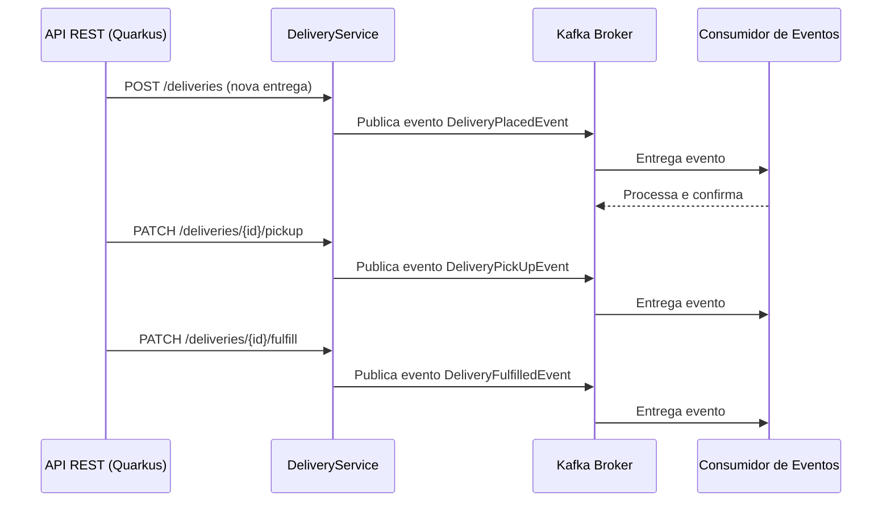

# 📦 Delivery Tracking — Migração para Quarkus

## ✅ Funcionalidades Implementadas

- Criação de rascunho de uma encomenda (`DRAFT`).
- Busca de encomenda pelo ID.
- Listagem de todas as encomendas de forma paginada.
- Edição dos detalhes de uma encomenda.
- Exclusão de uma encomenda.
- Submissão de uma encomenda para processamento → status `WAITING_FOR_COURIER`.
- Registro da retirada de uma encomenda pelo entregador → status `IN_TRANSIT`.
- Registro da conclusão de uma encomenda → status `DELIVERED`.

---

## ⚡ Integração com Kafka

- Dependência adicionada no `pom.xml`:
```xml
<dependency>
    <groupId>io.quarkus</groupId>
    <artifactId>quarkus-messaging-kafka</artifactId>
</dependency>
```

- Configuração no `application.yaml`:
```yaml
mp:
  messaging:
    outgoing:
      delivery-events:
        connector: smallrye-kafka
        topic: deliveries.v1.events
        value:
          serializer: br.com.elvisassis.infrastructure.kafka.JsonObjectSerializer
        key:
          serializer: org.apache.kafka.common.serialization.StringSerializer
```

- **Publisher** — Classe `DeliveryEventPublisher`:
```java
@ApplicationScoped
public class DeliveryEventPublisher {

    @Channel("delivery-events")
    Emitter<Object> emitter;

    public void onDeliveryPlaced(@Observes DeliveryPlacedEvent event) {
        emitter.send(event);
    }

    public void onDeliveryPickUp(@Observes DeliveryPickUpEvent event) {
        emitter.send(event);
    }

    public void onDeliveryFulfilled(@Observes DeliveryFulfilledEvent event) {
        emitter.send(event);
    }
}
```

- **Eventos disparados nas seguintes condições**:
  - Ao submeter uma encomenda para processamento → `WAITING_FOR_COURIER`.
  - Ao registrar retirada de uma encomenda → `IN_TRANSIT`.
  - Ao registrar conclusão de uma encomenda → `DELIVERED`.

- **Criação automática de tópico** (`KafkaTopicCreator.java`) para perfis `dev` e `test`.

---

## 🛠 Infraestrutura

- **Banco de dados**: Integração com **PostgreSQL**.
- **Mensageria**: Integração com **Kafka**.
- **Docker Compose** para subir **Kafka** e **PostgreSQL** localmente.

---

## 🚀 Instruções de Execução

1. **Pré-requisitos**
   - Java 21+
   - Maven 3.9+
   - Docker e Docker Compose

3. **Subir infraestrutura com Docker Compose**
```bash
docker compose up -d
```
Isso iniciará:
- **PostgreSQL** na porta `5434` (configurado no `application.yaml`)
- **Kafka** com tópicos configurados para `dev` e `test`

4. **Rodar a aplicação em modo dev**
```bash
./mvnw quarkus:dev
```
A aplicação ficará disponível em:
```
http://localhost:8080
```

5. **Testar endpoints**
- A API está documentada no **Swagger/OpenAPI** disponível em:
```
http://localhost:8080/q/swagger-ui
```

---

## 🔄 Fluxo de Eventos



---

## 🚧 Pendências

- Integração com o serviço **Courier** para cálculo do frete.
