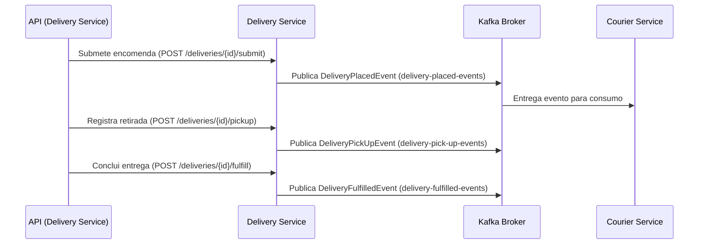

# Delivery Service (Quarkus)

## Visão Geral
O **Delivery Service** é responsável por gerenciar o ciclo de vida de encomendas dentro da plataforma.  
Ele implementa endpoints REST, integra com PostgreSQL para persistência e utiliza **Kafka** como barramento de eventos para comunicação assíncrona com o **Courier Service**.

## Funcionalidades Implementadas
- **Criação de Rascunho** de uma encomenda.
- **Buscar encomenda** por ID.
- **Listagem paginada** de encomendas.
- **Edição** dos detalhes de uma encomenda.
- **Remoção** de uma encomenda.
- **Submeter uma encomenda** para processamento (`WAITING_FOR_COURIER`).
- **Registrar retirada** de uma encomenda pelo entregador (`IN_TRANSIT`).
- **Registrar conclusão** da entrega (`DELIVERED`).

## Integração com Kafka
O Delivery atua como **Producer** de eventos relacionados ao ciclo de vida da entrega.

### Configuração no `application.yaml`
```yaml
mp:
  messaging:
    outgoing:
      delivery-placed-events:
        connector: smallrye-kafka
        topic: delivery-placed-events
        value.serializer: br.com.elvisassis.infrastructure.kafka.JsonObjectSerializer
        key.serializer: org.apache.kafka.common.serialization.StringSerializer

      delivery-pick-up-events:
        connector: smallrye-kafka
        topic: delivery-pick-up-events
        value.serializer: br.com.elvisassis.infrastructure.kafka.JsonObjectSerializer
        key.serializer: org.apache.kafka.common.serialization.StringSerializer

      delivery-fulfilled-events:
        connector: smallrye-kafka
        topic: delivery-fulfilled-events
        value.serializer: br.com.elvisassis.infrastructure.kafka.JsonObjectSerializer
        key.serializer: org.apache.kafka.common.serialization.StringSerializer
```

### Publicação de Eventos
Os eventos são enviados em momentos específicos do fluxo:

- **delivery-placed-events** → quando uma encomenda é submetida para processamento (`WAITING_FOR_COURIER`).
- **delivery-pick-up-events** → quando a encomenda é retirada pelo entregador (`IN_TRANSIT`).
- **delivery-fulfilled-events** → quando a encomenda é concluída (`DELIVERED`).

### Classe Publisher (exemplo)
```java
@ApplicationScoped
public class DeliveryEventPublisher {

    @Channel("delivery-placed-events")
    Emitter<Object> placedEmitter;

    @Channel("delivery-pick-up-events")
    Emitter<Object> pickUpEmitter;

    @Channel("delivery-fulfilled-events")
    Emitter<Object> fulfilledEmitter;

    public void onDeliveryPlaced(@Observes DeliveryPlacedEvent event) {
        placedEmitter.send(event);
    }

    public void onDeliveryPickUp(@Observes DeliveryPickUpEvent event) {
        pickUpEmitter.send(event);
    }

    public void onDeliveryFulfilled(@Observes DeliveryFulfilledEvent event) {
        fulfilledEmitter.send(event);
    }
}
```

## Integração com PostgreSQL
- Persistência configurada via **Panache ORM** (Quarkus Hibernate Reactive com Postgres).
- Scripts de criação de tabelas aplicados via `import.sql` ou `Flyway`.

## Docker Compose (infraestrutura local)
O projeto conta com um `docker-compose.yml` que provisiona:
- **PostgreSQL**
- **Apache Kafka + Zookeeper**

## Fluxo de Eventos


## Instruções de Execução
### Pré-requisitos
- **Java 21+**
- **Maven 3.9+**
- **Docker e Docker Compose**

### Passos
1. Subir infraestrutura local:
   ```sh
   docker compose up -d
   ```
2. Rodar o serviço Delivery em modo dev:
   ```sh
   ./mvnw quarkus:dev
   ```
3. Acessar a documentação da API no Swagger UI:
   ```
   http://localhost:8080/q/swagger-ui
   ```
